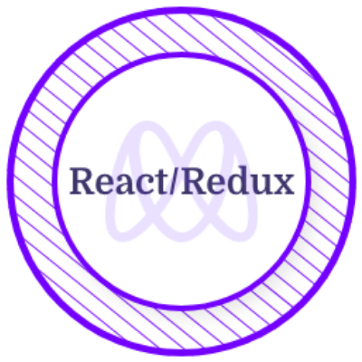
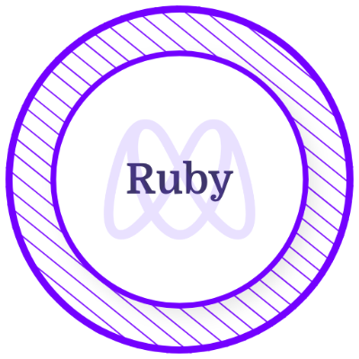
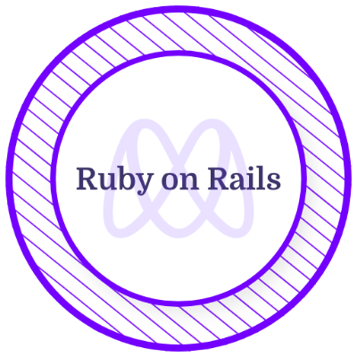

<h2 align="center">Hi</h2>

<h2 align="center">
  
</h2>

<h1 align="center">Engr. Fisayo Michael Animashaun (MNSE, FMP®, COREN)</h1>

<h3 align="center"> Transitioning software engineer demonstrating 2+ years of rapid growth in frontend and backend development (React, Ruby on Rails, Node.js), including self-study and the recently completed full-stack engineering program at Microverse. Successfully applying a deep understanding of operational needs, gained from 10+ years in facilities management, to create efficiency-boosting software solutions. Passionate about continuous learning and tackling new coding challenges.</h3>

## Badges

    
    
     
    
    
    
    
    

<h3 align="left">Connect with me:</h3>

  

  

  

  

  

  

  

  
  

  

<h3 align="left">Languages and Tools:</h3>

 
  
    
  
   

  

  

  

  
  
  
  
  
  
  
  
  
  
  

   
    
   
      
  

   
       
  

   
  
   
  
   
  
   
  
    
  
  
  
   
  
  
  
   

  

   
  
  

   
  
   
  

    

   

    
  

  

  
  

  
  

  <!--
   

   

   
     
   
     

    

    

  
   
  
   

   

    
  
-->
